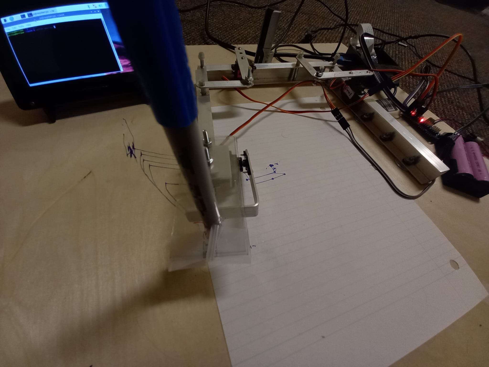
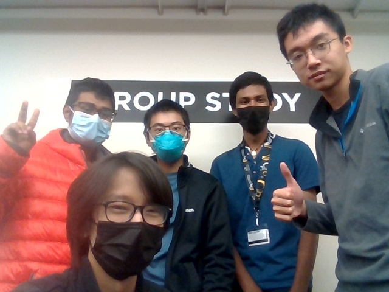

# The Artificial Picasso by Mahjong



* [**The Artificial Picasso Official Documentation Site**](https://w4zel.github.io/ArtificialPicasso/)
* [**Waterloo Software Engineering**](https://uwaterloo.ca/future-students/programs/software-engineering)



Hello! We are Mahjong, a small group of software engineering students at the University of Waterloo passionate about the integration of technology and art.

We bring to you *The Artificial Picasso*: a robot that sketches out a physical drawing based on an image or a picture taken from a camera.


<br>📷 See more info below ⬇️

# **😎 Creators**
Max Lu - [RedcXca](https://github.com/RedcXca)
<br>
Howard Ou - [w4zEl](https://github.com/w4zEl)
<br>
Amruth Arunkumar - [AmruthArunkumar](https://github.com/AmruthArunkumar)
<br>
Adib Raed - [Aries1124](https://github.com/Aries1124)
<br>
Jason Cheng - [jcheng3927](https://github.com/jcheng3927)

# **⭕ How to Use**
1. [Download Python 3](https://www.python.org/downloads/).
2. Clone the repository.

    ```shell
    git clone https://github.com/w4zEl/ArtificialPicasso.git
    ```

3. Install the dependencies.

    ```shell
    pip install -r requirements.txt
    ```

4. Run `main.py`.

    ```shell
    python main.py
    ```

5. Take a picture and see the animated tracing. Enjoy!

# 🧰 Hardware

- Raspberry Pi
- PCA9685
- MG90S Servos
- And more...

# **🍎 Built With**
Love, sweat, and tears

# **🎹 License**
Distributed under the [GNU General Public License v2.0](https://www.gnu.org/licenses/old-licenses/gpl-2.0.en.html). See [LICENSE](LICENSE) for more information.

**Mahjong**

